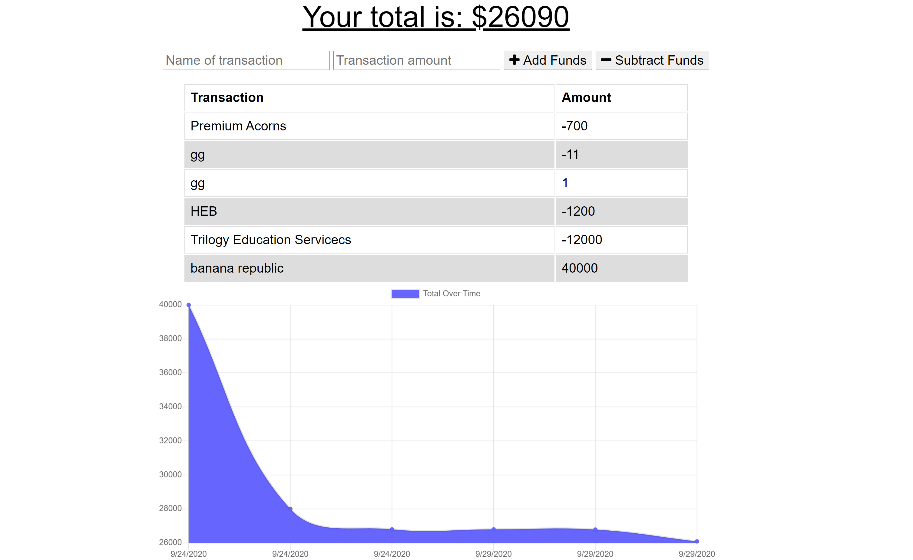

# Online/Offline Budget Tracker

    
## Github
    https://github.com/chrscchrn

## Questions
    cochraschris@gmail.com

### Description
    This website can be used for tracking your finances regardless if you lose internet access. This is done by including a webmanifest, service-worker, caching, and using a browser which supports indexed database. The user can expect to install as a desktop application.

### Installation
    npm i

### Usage
    npm start
    Go to Localhost:3000

### License
    ISC

### Contributing
    Email Author

### Screenshots

### Link to Website
       
